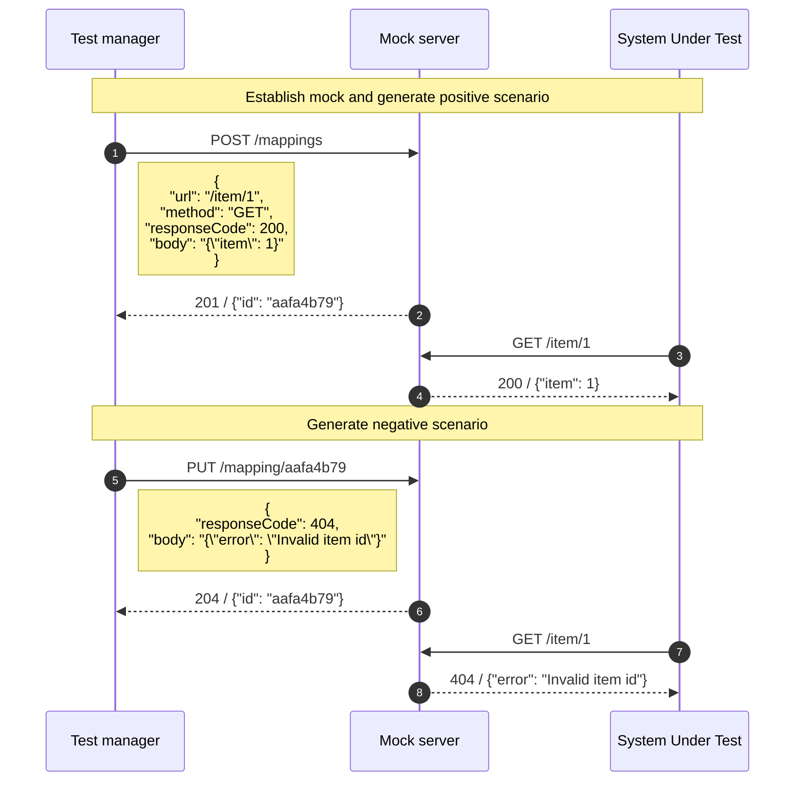

# Usage flow

```mermaid
sequenceDiagram
    autonumber
    participant TM as Test manager
    participant MS as Mock server
    participant SU as System Under Test

Note over TM,SU: Establish mock and generate positive scenario
TM ->> MS: POST /mappings
Note right of TM: {<br>"url": "/item/1",<br>"method": "GET",<br>"responseCode": 200,<br>"body": "{\"item\": 1}"<br>}

MS -->> TM : 201 / {"id": "aafa4b79"}

SU ->> MS: GET /item/1
MS -->> SU: 200 / {"item": 1}

Note over TM,SU: Generate negative scenario
TM ->> MS: PUT /mapping/aafa4b79
Note right of TM: {<br>"responseCode": 404,<br>"body": "{\"error\": \"Invalid item id\"}"<br>}

MS -->> TM : 204 / {"id": "aafa4b79"}

SU ->> MS: GET /item/1
MS -->> SU: 404 / {"error": "Invalid item id"}
```
