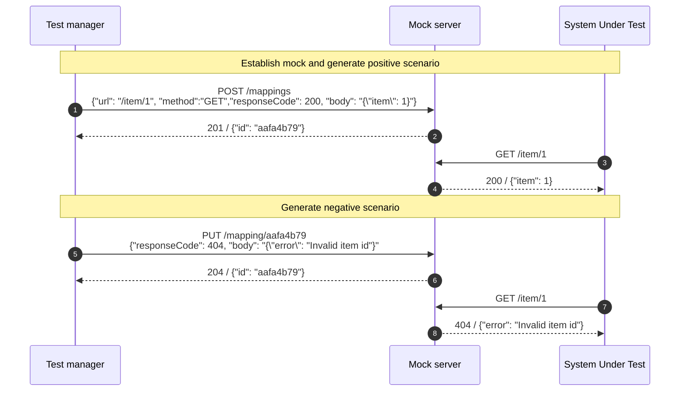

# Usage flow

```mermaid
sequenceDiagram
    autonumber
    participant TM as Test manager
    participant MS as Mock server
    participant SU as System Under Test

Note over TM,SU: Establish mock and generate positive scenario
TM ->> MS: POST /mappings <br/> {"url": "/item/1", "method":"GET","responseCode": 200, "body": "{\"item\": 1}"}

MS -->> TM : 201 / {"id": "aafa4b79"}

SU ->> MS: GET /item/1
MS -->> SU: 200 / {"item": 1}

Note over TM,SU: Generate negative scenario
TM ->> MS: PUT /mapping/aafa4b79 <br/> {"responseCode": 404, "body": "{\"error\": "Invalid item id"}"

MS -->> TM : 204 / {"id": "aafa4b79"}

SU ->> MS: GET /item/1
MS -->> SU: 404 / {"error": "Invalid item id"}
```
